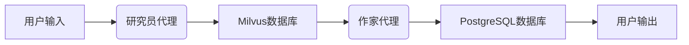

# 系统架构文档

## 概述

AI研究助手是一个基于微服务架构的AI应用系统，主要由两个核心代理（研究员代理和作家代理）、向量数据库（Milvus）和关系数据库（PostgreSQL）组成。

## 核心组件

### 1. 研究员代理 (Research Agent)

负责：
- 接收用户研究主题
- 生成相关内容
- 使用嵌入模型将文本转换为向量
- 将向量数据存储到Milvus数据库

### 2. 作家代理 (Writer Agent)

负责：
- 根据研究主题从Milvus检索相关信息
- 使用大语言模型生成结构化报告
- 将最终报告存储到PostgreSQL数据库

### 3. Milvus向量数据库

功能：
- 存储文本嵌入向量
- 提供高效的相似性搜索
- 支持大规模向量数据管理

### 4. PostgreSQL关系数据库

功能：
- 存储结构化研究报告
- 管理用户会话和历史记录
- 提供持久化数据存储

## 数据流



## API接口

### Flask版本

1. `GET /` - 返回主页
2. `POST /generate_report` - 生成研究报告
3. `GET /report_status/<report_id>` - 获取报告状态
4. `POST /chat` - 处理聊天消息
5. `GET /conversation/<conversation_id>` - 获取对话历史

### FastAPI版本

1. `GET /` - 返回主页
2. `POST /generate_report` - 生成研究报告
3. `GET /report_status/{report_id}` - 获取报告状态
4. `POST /chat` - 处理聊天消息
5. `GET /conversation/{conversation_id}` - 获取对话历史

## 部署架构

```
+------------+    +-------------+    +-----------------+
|   Client   |----|  Load Balancer |----| Web Servers     |
+------------+    +-------------+    +-----------------+
                                      | Flask/FastAPI   |
                                      +-----------------+
                                             |
                  +-------------------------+-------------------------+
                  |                         |                         |
            +-----------+            +-----------+            +-----------+
            |  Milvus   |            |PostgreSQL |            |   Redis   |
            +-----------+            +-----------+            +-----------+
```